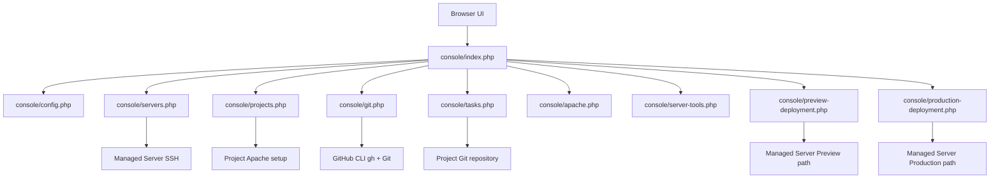
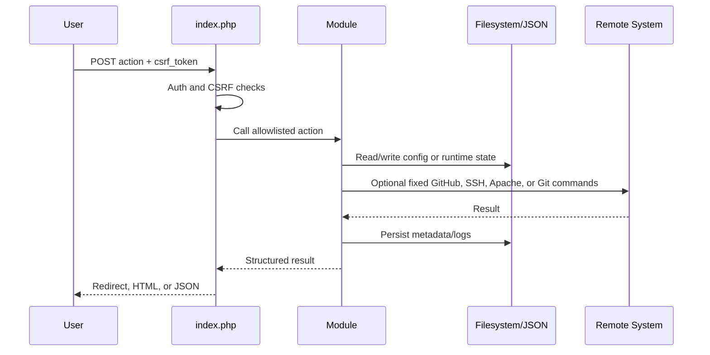
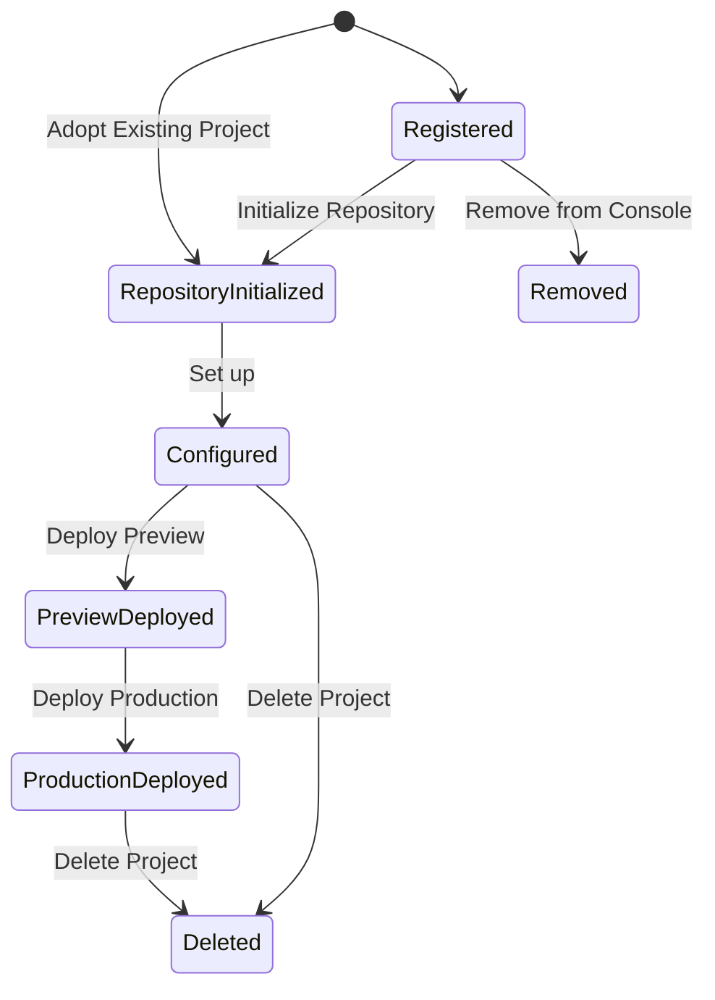
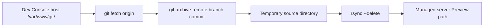

# Dev Console Architecture

## Purpose

Dev Console is a PHP-based internal operations console for managing projects, task workflows, GitHub repositories, managed Linux servers, Apache setup, Preview deployment, and Production promotion.

The application is intentionally file-backed. Project, server, GitHub, operation, and task state are stored as JSON files, Markdown task files, Git repositories, and runtime operation logs on disk.

## Major Components



The main entry point is `console/index.php`. It loads the helper modules, performs authentication and CSRF validation, routes POST actions, renders the tabbed UI, and exposes JSON polling endpoints.

The current top-level UI sections are Dashboard, Projects, Servers, Server Management, Documentation, and Settings.

## Data Flow

Most user actions follow this pattern:

1. A browser form or JavaScript request submits to `console/index.php`.
2. `index.php` validates authentication, CSRF, and the requested action.
3. The relevant module performs validation and filesystem, Git, GitHub, Apache, or SSH operations.
4. State is persisted to JSON files or project repositories.
5. Long-running operations write runtime JSON and log files that the browser polls.
6. The UI displays the result summary and raw operation log when available.



## Configuration Files

Dev Console currently uses these primary configuration files:

- `config/projects.json`: project registry, active project, project Git metadata, setup metadata, and deployment metadata.
- `config/github.json`: GitHub account and Personal Access Token configuration.
- `console/config/servers.json`: managed server registry and last SSH diagnostics.
- `/etc/iovon-dev-console.env`: service environment file required by bootstrap and systemd.
- `/etc/systemd/system/iovon-dev-console.service`: installed systemd unit generated from `systemd/iovon-dev-console.service`.

Runtime operation state is stored under:

- `console/runtime/server-tool-operations`
- `console/runtime/managed-server-operations`
- `console/runtime/preview-deployments`
- `console/runtime/production-deployments`
- `console/runs/projects/<project-id>`

The legacy deployment module also defines `DEPLOY_STATE_DIR` as `/tmp/iovon-deployments`; `index.php` uses that location for PHP session storage.

## Project Lifecycle

A project is stored in `config/projects.json`. New projects receive generated default paths:

- project root: `/var/www/projects/<project-id>`
- Preview path: `/var/www/projects/<project-id>/preview`
- Production path: `/var/www/projects/<project-id>/production`
- repository path: `/var/www/git/<project-id>`

Project creation records metadata only. Repository initialization, server setup, Preview deployment, and Production deployment are separate actions.

Existing hosted projects can also be adopted. Adoption imports the selected source directory from a Managed Server into `/var/www/git/<project-id>` on the Dev Console host, preserves compatible Git and TASKS history when present, and registers the project only after the import succeeds. Existing Preview, Production, and Apache configuration are adopted in place and are not modified by adoption.



## Managed Server Lifecycle

Managed servers are stored in `console/config/servers.json`. A server record contains display metadata, SSH connection settings, key fingerprint, status, and last diagnostic results.

The current server onboarding model uses one shared Dev Console SSH key. The generated setup command is intended to be run on the managed server as the deployment user. It installs the public key into that user's `authorized_keys`, configures passwordless sudo through `/etc/sudoers.d/dev-console-<user>` for non-root users, validates sudoers with `visudo`, and prepares `/var/www/projects`.

Server connection tests run asynchronously through `console/run-managed-server.php` and execute a fixed SSH diagnostic command that collects hostname, kernel, working directory, remote user, optional OS release data, sudo readiness, remote PHP/Composer/Node.js/npm diagnostics, Apache service state, and Apache virtual host inventory. Managed servers are deployment targets; Git and GitHub operations remain Dev Console host responsibilities.

## Git Lifecycle

Project repositories live on the Dev Console host under `/var/www/git/<project-id>`. Dev Console expects project remotes to use the account-level SSH alias:

```text
git@github.com-dev-console-account:<account>/<repository>.git
```

Dev Console has one global GitHub configuration in Settings. Projects use that global account/authentication; they do not have separate GitHub credentials. GitHub-specific operations use `gh` with the saved Personal Access Token passed through the `GH_TOKEN` child-process environment. Normal Git operations remain Git commands and use the configured remote.

Repository initialization:

1. Verifies GitHub configuration and `gh` availability.
2. Verifies `/var/www/git` exists and is writable.
3. Checks whether the preferred GitHub repository exists.
4. Creates a local repository.
5. Writes `README.md`, `.gitignore`, and `TASKS/README.md`.
6. Commits initial files.
7. Creates a private GitHub repository.
8. Sets the origin remote.
9. Pushes `main`.
10. Fetches and stores repository metadata.

Existing repository collisions do not attach to, overwrite, or delete the existing GitHub repository. The UI can suggest an alternate repository name while preserving the project ID.

## Task Lifecycle

Tasks live inside each project repository under:

```text
TASKS/
  README.md
  TODO/
  IN PROGRESS/
  DONE/
  DROPPED/
  attachments/
```

Older `TASKS/ATTACHMENTS/` directories remain readable for compatibility.

Each task file starts with visible generated YAML Front Matter:

```yaml
---
task_id: TASK-001
project_id: <project-id>
title: Example task
status: TODO
created_at: 2026-08-14T00:00:00+00:00
updated_at: 2026-08-14T00:00:00+00:00
attachments: []
---
```

Task numbers are project-specific. Task lists are grouped as TODO, IN PROGRESS, DONE, and DROPPED. Attachments are stored under `TASKS/attachments/<task-id>/` and referenced from YAML metadata.

When Codex runs a task, Dev Console moves the task from TODO to IN PROGRESS, runs Codex inside the project repository, commits implementation changes outside `TASKS/`, then moves the task to DONE and commits the task lifecycle update separately.

TODO tasks remain editable and can be dropped before execution. If an IN PROGRESS task has a failed Codex run, the user can retry it or explicitly drop it. Dropping moves the task to DROPPED and commits only the lifecycle change; failed Codex run status remains separate from task lifecycle status.

## Deployment Architecture

Preview and Production deployment are implemented as separate asynchronous operation systems.

Preview deployment uses this architecture:



Managed servers receive files through SSH/rsync. They are not expected to clone repositories or run Git for Dev Console Preview or Production deployment.

Preview deploys GitHub repository content as-is except for Dev Console operational metadata exclusions:

- `.git/`
- `TASKS/`

Production deployment promotes the current remote Preview contents to the remote Production path using remote `rsync --delete`. It does not fetch GitHub and does not rebuild a source archive. Before promotion, Dev Console stores a read-only Production preflight result for the current Preview commit. The preflight blocks unreviewed Production-only deletion candidates unless the Project has explicit relative preserve rules for those paths.

## Preview / Production Architecture

New projects have generated default environment paths:

- Preview: `/var/www/projects/<project-id>/preview`
- Production: `/var/www/projects/<project-id>/production`

Adopted projects may preserve arbitrary existing Preview and Production paths when those paths are explicitly stored in project configuration. Generic project, deployment, and diagnostics code uses the configured paths; it must not reconstruct environment paths from the project ID except when creating a new project default.

Project setup creates Apache virtual hosts for both environments when Dev Console owns that infrastructure. Adopted-in-place infrastructure may be recorded as already configured without rewriting existing Apache configuration. For managed servers, Apache configuration is installed remotely over SSH. For the older local setup path, Apache configuration is installed on the local server.

Production deployment requires a successful Preview deployment first. Production copies Preview to Production on the managed server.

## Apache Integration

Apache diagnostics are in `console/apache.php`. Detection checks known binaries such as `/usr/sbin/apache2` and `/usr/sbin/httpd`, then uses fixed `systemctl` commands where available.

Apache is not shown as a Dev Console host Setting in the current UI. Settings is scoped to Dev Console runtime/configuration and local host prerequisites such as Git, PHP, Codex CLI, and GitHub configuration.

Project setup writes managed Apache virtual host files with Dev Console ownership markers and refuses to overwrite unrelated existing files. Server Management displays Apache status, version, binary path, enabled state, and virtual host inventory for the selected managed server from remote SSH diagnostics.

The local managed ServerName config is:

```text
/etc/apache2/conf-available/iovon-dev-console-servername.conf
```

with managed content:

```apache
# Managed by IOVON Dev Console
ServerName localhost
```

## GitHub Integration

GitHub configuration is stored in `config/github.json`. The token is passed to GitHub CLI commands as `GH_TOKEN` in the process environment. It is not passed as a command-line argument.

Current GitHub operations include:

- connection test through `gh api user`
- organization/account verification
- private repository creation
- repository metadata lookup
- exact configured repository deletion during Project deletion when explicitly selected

The UI no longer relies on `gh auth login` state as the GitHub authentication source.

## Security Model

The application requires the `IOVON_DEV_CONSOLE_TOKEN` environment variable for login. POST actions require the session CSRF token. The `/health` endpoint is intentionally unauthenticated.

Command execution is mostly centralized through `console/process.php`, which runs argv arrays through `proc_open`, supports timeouts, and redacts known token values from logs.

Destructive actions use explicit confirmation. Project deletion requires typing the exact project display name. GitHub repository deletion is unchecked by default and only available for a verified configured repository identity.

## SSH Model

Managed server SSH configuration stores only the key path and fingerprint. Dev Console does not copy private keys into project folders and does not display private key contents.

Connection tests use a fixed command set:

- `echo connected`
- `hostname`
- `uname -a`
- `pwd`
- `whoami`
- optional read-only OS release inspection
- `sudo -n true` capability check for non-root users
- remote PHP, Composer, Node.js, npm, and Apache detection commands

SSH command lines shown to the user are sanitized and do not include private key contents.

## Privilege Model

Managed server privileged operations use:

```text
sudo -n
```

for non-root SSH users. If the SSH user is `root`, Dev Console runs privileged commands directly.

The onboarding command configures passwordless sudo with:

```text
<user> ALL=(ALL) NOPASSWD: ALL
```

under `/etc/sudoers.d/dev-console-<user>`, after validation with `visudo`.

No custom Apache helper binary is part of the current source.

## File Layout

Important repository files:

```text
bootstrap.sh
systemd/iovon-dev-console.service
console/index.php
console/config.php
console/process.php
console/apache.php
console/server-tools.php
console/servers.php
console/projects.php
console/git.php
console/tasks.php
console/run-codex.php
console/preview-deployment.php
console/run-preview-deployment.php
console/production-deployment.php
console/run-production-deployment.php
console/deployment.php
console/run-deployment.php
README.md
docs/DEV_CONSOLE.md
```

Generated local files and directories include:

```text
config/projects.json
config/github.json
console/config/servers.json
console/runtime/
console/runs/projects/
/var/www/git/<project-id>
/var/www/projects/<project-id>/preview
/var/www/projects/<project-id>/production
/tmp/dev-console-preview-deployments/
/tmp/iovon-deployments/
```

## Generated Apache Configuration

Managed project virtual hosts include Dev Console markers, project ID, environment, `ServerName`, `DocumentRoot`, directory permissions, and environment-specific Apache logs.

Remote managed-server vhost names use:

```text
<project-id>-preview.conf
<project-id>-production.conf
```

The older local setup path uses:

```text
dev-console-<project-id>-preview.conf
dev-console-<project-id>-production.conf
```

## Project Metadata

Project metadata stores identity, managed server binding, configured environment paths, Git state, setup/provisioning state, Preview deployment metadata, Production deployment metadata, and timestamps.

The implementation still keeps both `provisioning` and `setup` metadata. `provisioning` is historical/internal; `setup` is the newer user-facing state.
