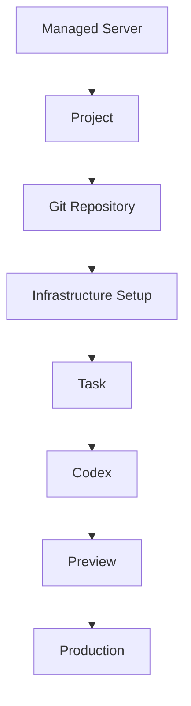
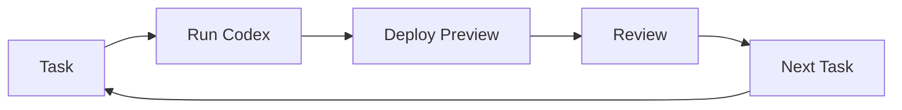

# Workflow

## Main Flow

If Mermaid rendering is not available, read the flow as:

Managed Server -> Project -> Git Repository -> Infrastructure Setup -> Task -> Codex -> Preview -> Production.

## Iteration Loop

The usual development loop is:

1. Create Task.
2. Run Codex.
3. Review the commit and task result.
4. Deploy Preview.
5. Review the website.
6. Create the next task, or promote Preview to Production.

## Current Boundaries

- Project creation does not create remote infrastructure.
- Repository initialization does not deploy anything.
- Set up prepares directories and Apache configuration.
- Preview deployment prepares the Project Git state on the Dev Console host and transfers files to the Managed Server with SSH/rsync. Current v1 behavior defaults to `main` and does not expose branch selection in the UI.
- Production deployment promotes the current Preview contents.
